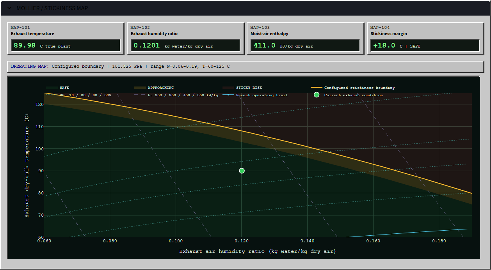

# APC Spray Dryer Learning Lab

A Python process-control project that progresses from single-input control
foundations to a live constrained multivariable model predictive control (MPC)
spray-dryer simulation.

> This project is a process-control simulation and has not been validated for
> operational control.


## Who This Is For

The project is intended for process and control engineers learning Python and
for technical reviewers who want an inspectable APC example. Equations,
controller behavior, constraints, and disturbances remain visible rather than
being hidden behind a control-system interface.

## Learning Progression

### 1. SISO Foundations

`run_lab.py` introduces powder moisture as the controlled variable, inlet-air
temperature as the manipulated variable, and inlet humidity as a disturbance.
It covers:

1. a first-order process simulation with noise and dead time;
2. a hand-written PID with anti-windup and actuator limits;
3. first-order-plus-dead-time fitting from a step test;
4. a compact SISO MPC and PID-versus-MPC comparison.

The script writes reproducible plots to the ignored `artifacts/` directory.

### 2. Live Multivariable APC

`live_app.py` is the capstone lab. Its late-1990s-style industrial SCADA screen
simulates three manipulated variables:

- feed flow;
- inlet-air flow;
- inlet-air temperature.

The MPC predicts four constrained outputs:

- exhaust-air temperature;
- feed pressure;
- powder moisture;
- exhaust-air humidity.

Manual mode accepts operator input commands. APC mode predicts future
behavior, optimizes the selected target, maximize, or minimize objective,
applies the first move, and solves again. Each input has an operating range,
move limit, and enable/freeze switch.

### Guided APC Showcase

Press **RUN APC SHOWCASE** in the operator station for one deterministic,
100-simulation-minute demonstration. It holds nominal manual inputs while
humid weather and a tank change move the process, enables APC at minute 55,
and applies a later tank-change challenge before pausing with summary metrics.
The summary reports target-band time, normalized controlled-variable error,
moisture deviation, constraint violations, recovery time, and input movement;
it is a guided run rather than a controlled A/B benchmark. **HOLD** pauses the
scenario, and leaving showcase mode restores the normal interactive dashboard.

### Measurements And Disturbances

The simulated plant retains noise-free internal states. The dashboard and
controller receive measured outputs with configurable, seeded sensor noise:
Off, Low, Normal, or High.

Tank A, Tank B, and Tank C have incoming feed dry matter of 50.0%, 52.0%, and
48.5%. Manual or scheduled tank changes alter the feed water load through a
two-minute feed-line mixing lag. Inlet-air humidity can remain constant, follow
a smooth daily cycle, or include reproducible humid-weather events.

Feed dry matter and inlet humidity are not supplied to the controller as
measured-disturbance feedforward variables. The MPC rejects their effects
through measured-output feedback after the plant responds.

### Live Process Trends

The persistent client-side Plotly component appends samples without rebuilding
the charts each scan. The left column contains the three input commands plus
feed dry matter and inlet-air humidity. The right column contains the four
controlled outputs, predictions, targets, and constraints. Both columns share
simulation time and tank/weather event markers while retaining zoom,
auto-follow, HOLD, and RESET behavior.

### Mollier / Stickiness Map

The collapsed operating-map section combines true simulated exhaust-air
temperature and humidity ratio. It includes selected relative-humidity curves,
constant-enthalpy lines, a saturation segment, a 60-sample operating trail,
and a configured stickiness boundary. The displayed margin is:

```text
stickiness margin = boundary temperature at current humidity
                  - current exhaust temperature
```

The boundary is configured for this model and is not product-specific. Tank,
weather, and control changes move the point only through the simulated process
response.



## Architecture

| Path | Purpose |
| --- | --- |
| `live_app.py` | Streamlit UI and live simulation orchestration. |
| `run_lab.py` | Runnable SISO learning sequence and static figures. |
| `apc_lab/live_dryer.py` | Multivariable process simulation and constrained MPC. |
| `apc_lab/equations.py` | Display-ready model and controller equations. |
| `apc_lab/model_fitting.py` | Multivariable gain, time-constant, and delay fitting. |
| `apc_lab/psychrometrics.py` | Moist-air references and configured stickiness assessment. |
| `apc_lab/process_trends_component.py` | Persistent Process Trends wrapper and payload logic. |
| `apc_lab/operating_map_component.py` | Persistent operating-map wrapper and payload logic. |
| `apc_lab/scada_ui.py` | Reusable retro SCADA styling and status helpers. |
| `apc_lab/spray_dryer.py` | Introductory SISO process simulation. |
| `apc_lab/pid.py` | PID implementation with anti-windup and limits. |
| `apc_lab/identification.py` | SISO FOPDT model and step-response fitting. |
| `apc_lab/mpc.py` | Introductory SISO MPC. |
| `tests/` | Process, controller, component, disturbance, and fitting tests. |

The live steady-state model has the form:

```text
y_ss = y_nominal + K @ (u_delayed - u_nominal)
     + k_DM * (DM - DM_nominal) + k_H * (H_in - H_in_nominal)
y_true[k+1] = y_true[k] + response_fraction * (y_ss[k] - y_true[k])
y_measured[k] = y_true[k] + sensor_noise[k]
```

The true plant, noisy measurements, and MPC predictor are separate. Fitting a
dataset updates the controller predictor and does not replace the simulated
plant.

## Installation

Python 3.10 or newer is required.

```powershell
python -m venv .venv
.\.venv\Scripts\Activate.ps1
python -m pip install --upgrade pip
python -m pip install -e ".[dev]"
```

On macOS or Linux, activate the environment with
`source .venv/bin/activate`.

## Run

Start the live dashboard:

```powershell
streamlit run live_app.py
```

Run the SISO learning sequence:

```powershell
python run_lab.py
```

## Test

```powershell
python -m pytest -q
python -c "from streamlit.testing.v1 import AppTest; app=AppTest.from_file('live_app.py'); app.run(timeout=30); assert not app.exception"
python -m pip check
```

The tests use fixed seeds and generated process data for reproducibility.

## Model Fitting Data

The dashboard accepts evenly sampled, time-ordered CSV data with these exact
columns:

```text
Feed flow
Inlet air flow
Inlet air temperature
Exhaust air temperature
Feed pressure
Powder moisture
Exhaust air humidity
```

An example identification dataset can be downloaded from the app. Uploaded
data remains in the active Streamlit session and is not written to the
repository.

## Limitations

- The process is a linear gain, delay, and first-order lag approximation rather
  than a full mass-and-energy balance.
- Sensor noise is independent Gaussian noise without bias, drift, filtering,
  or correlated disturbances.
- Feed composition uses a simple feed-line lag, and inlet humidity uses a
  deterministic daily profile and generic weather event.
- The operating map uses approximate moist-air relationships and one
  product-independent configured boundary.
- The MPC supports one primary objective at a time.
- Dataset fitting assumes clean, numeric, evenly sampled data and does not
  calculate statistical confidence.

## License

The project is released under the [MIT License](LICENSE). The vendored
Plotly.js license is retained in [THIRD_PARTY_NOTICES.md](THIRD_PARTY_NOTICES.md).
