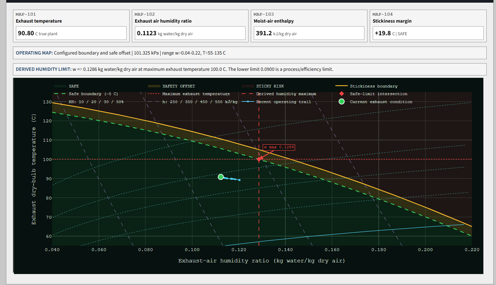

# APC Spray Dryer Learning Lab

A Python process-control project that progresses from single-input control
foundations to a live constrained multivariable model predictive control (MPC)
spray-dryer simulation.

> This project is a process-control simulation and has not been validated for
> operational control.




## Who This Is For

The project is intended for process and control engineers learning Python and
for technical reviewers who want an inspectable APC example. Equations,
controller behavior, constraints, and disturbances remain visible rather than
being hidden behind a control-system interface.

## Learning Progression

### 1. SISO Foundations

`run_lab.py` introduces powder moisture as the controlled variable, inlet-air
temperature as the manipulated variable, and inlet humidity as a disturbance.
It covers:

1. a first-order process simulation with noise and dead time;
2. a hand-written PID with anti-windup and actuator limits;
3. first-order-plus-dead-time fitting from a step test;
4. a compact SISO MPC and PID-versus-MPC comparison.

The script writes reproducible plots to the ignored `artifacts/` directory.

### 2. Live Multivariable APC

`live_app.py` is the capstone lab. Its compact industrial SCADA-style screen
simulates three manipulated variables:

- feed flow;
- inlet-air flow;
- inlet-air temperature.

The MPC predicts four constrained outputs:

- exhaust-air temperature;
- feed pressure;
- powder moisture;
- exhaust-air humidity.

Manual mode accepts operator input commands. APC mode uses the MPC to predict
future behavior, solve the selected Target, Maximize, or Minimize objective,
apply the first move, and solve again. Each input has an operating range, move
limit, and enable/freeze switch.

Use the top-level **Workspace** selector to move between normal **APC Station**
operation and the focused **Commissioning Lab**. Both workspaces use the same
plant, controller, RUN/HOLD state, and Streamlit session; the Commissioning Lab
does not add another simulation lifecycle.

### 3. Commissioning Lab

The Commissioning Lab supplies the missing bridge from process data to a
working controller:

1. **Collect data:** from a reset baseline, run a deterministic Manual-mode
   experiment that moves one MV at a time in positive and negative directions.
   Estimation and validation samples are labelled separately and stored in a
   dedicated buffer rather than the bounded Process Trends history. HOLD pauses
   collection, and the complete CSV can be downloaded.
2. **Fit a candidate:** estimate the 4 x 3 gain matrix, one time constant per
   CV, one shared integer delay, and dataset nominal values from the estimation
   period. Fit does not change the active controller.
3. **Validate:** free-run the candidate over separate estimation and validation
   periods. Measured-versus-predicted overlays and RMSE, MAE, fit percentage,
   and derivative-fit RMSE keep regression error distinct from output-response
   error. Basic diagnostics flag weak or dependent MV excitation and weak CV
   response.
4. **Apply deliberately:** only a validated candidate can be applied, and only
   while the process is in HOLD. Applying changes the MPC predictor, never the
   synthetic plant. The active model source and revision remain visible, and
   the complete built-in predictor can be restored.
5. **Tune and compare:** change the target-controlled CV, scalar tracking
   weight, scalar MV move penalty, and prediction horizon. Save two presets and
   run a deterministic offline Tank C comparison using identical initial state,
   model, noise seed, constraints, and disturbance.

The comparison reports recovery time, target-CV integrated absolute error,
normalized CV error, maximum constraint violation, violation count, and total
normalized MV movement. It is intentionally an educational A/B exercise, not
an automatic tuner. Return to APC Station to operate the active model and
tuning, then finish with the existing Showcase after a normal RESET.

#### Commissioning Quick Start

1. Press **RESET**, select **Commissioning Lab**, and choose the scan duration
   and sensor-noise setting in the sidebar. A five-minute scan completes the
   guided experiment fastest; the selected duration becomes the dataset sample
   time.
2. Press **PREPARE GUIDED EXPERIMENT**. This creates the deterministic step
   sequence and clears earlier Commissioning Lab samples, but does not start
   the process.
3. Press **START / RESUME COLLECTION**. The normal simulation runs in Manual
   mode and moves one MV at a time. Use sidebar **HOLD** to pause and **RUN** or
   **START / RESUME COLLECTION** to continue. Follow the **NEXT ACTION** message
   and phase counter.
4. After both data periods finish, press **FIT CANDIDATE MODEL**. The maximum
   dead-time setting limits how far the fitter searches; fitting does not
   activate the result.
5. Press **VALIDATE CANDIDATE** to compare free-run predictions with measured
   estimation and validation data. Review the metrics and response overlays,
   then press **APPLY TO MPC** to activate the predictor. **RESTORE BUILT-IN**
   returns every predictor parameter to its original value.
6. Choose a target-controlled CV and adjust the tracking weight, move penalty,
   and prediction horizon. **APPLY TUNING TO MPC** changes the live controller;
   **SAVE AS TUNING A/B** only stores comparison presets.
7. Press **RUN FAIR A/B COMPARISON**. This runs both presets offline against the
   same Tank C disturbance and does not advance or modify the live process.

Higher tracking weight generally produces stronger target correction. Higher
move penalty favours smoother, slower MV commands. A longer prediction horizon
looks further ahead but requires more optimization work. For the comparison,
lower recovery time and error are preferable, zero constraint violations is
the goal, and normalized MV movement shows the actuator cost of faster control.

### Guided APC Showcase

Press **RUN APC SHOWCASE** in the operator station for one deterministic,
100-simulation-minute operator sequence with two minutes represented by each
scan. It starts the normal simulation in manual control, changes from Tank A to
Tank C around minute 15, enables APC around minute 35, and changes back to Tank
A around minute 65. At minute 100 the automation releases control without
resetting or pausing: the process keeps running, MPC remains active, and the
normal controls become available with all state and trends retained. **HOLD**
can pause the sequence. A new Showcase requires a normal **RESET**.

### Measurements And Disturbances

The simulated plant retains noise-free internal states. The dashboard and
controller receive measured outputs with configurable, seeded sensor noise:
Off, Low, Normal, or High.

Tank A, Tank B, and Tank C have incoming feed dry matter of 50.0%, 52.0%, and
48.5%. Manual or scheduled tank changes alter the feed water load through a
two-minute feed-line mixing lag. Feed pressure is shown on a synthetic
100-bar nominal scale. Inlet-air humidity can remain constant, follow a smooth
daily cycle above and below nominal, or include reproducible humid-weather
events.

Feed dry matter and inlet humidity are not supplied to the controller as
measured-disturbance feedforward variables. The MPC rejects their effects
through measured-output feedback after the plant responds.

### Live Process Trends

The persistent client-side Plotly.js component appends samples in place without
rebuilding the charts each scan. The left column contains the three input
commands plus feed dry matter and inlet-air humidity. The right column contains
the four controlled outputs, predictions, targets, and constraints. Both
columns share simulation time and tank/weather event markers while retaining
zoom, auto-follow, HOLD, and RESET behavior.

### Mollier / Stickiness Map

The collapsed operating-map section combines true simulated exhaust-air
temperature and humidity ratio. It includes selected relative-humidity curves,
constant-enthalpy lines, a saturation segment, a 60-sample operating trail,
a configured stickiness boundary, and a five-degree temperature safety offset.
The intersection of that safe boundary with the configured maximum exhaust-air
temperature determines the MPC upper constraint for exhaust air humidity. The
same limit appears in Process Trends, the dashboard, and the map. The lower
humidity limit remains a process/efficiency constraint. With the default
100 C maximum exhaust-air temperature, the derived upper humidity limit is
approximately 0.1286 kg water/kg dry air. The displayed margin is:

```text
stickiness margin = boundary temperature at current humidity
                  - current exhaust temperature
```

The boundary is configured simulation logic, not a universally valid product or
industrial correlation. Tank, weather, and control changes move the point only
through the simulated process response.

## Architecture

| Path | Purpose |
| --- | --- |
| `live_app.py` | Streamlit UI and live simulation orchestration. |
| `run_lab.py` | Runnable SISO learning sequence and static figures. |
| `apc_lab/live_dryer.py` | Multivariable process simulation and constrained MPC. |
| `apc_lab/equations.py` | Display-ready model and controller equations. |
| `apc_lab/model_fitting.py` | Multivariable gain, time-constant, and delay fitting. |
| `apc_lab/commissioning.py` | Guided experiment, validation, model lifecycle, and tuning comparison logic. |
| `apc_lab/psychrometrics.py` | Moist-air references and configured stickiness assessment. |
| `apc_lab/process_trends_component.py` | Persistent Process Trends wrapper and payload logic. |
| `apc_lab/operating_map_component.py` | Persistent operating-map wrapper and payload logic. |
| `apc_lab/scada_ui.py` | Reusable compact SCADA styling and status helpers. |
| `apc_lab/spray_dryer.py` | Introductory SISO process simulation. |
| `apc_lab/pid.py` | PID implementation with anti-windup and limits. |
| `apc_lab/identification.py` | SISO FOPDT model and step-response fitting. |
| `apc_lab/mpc.py` | Introductory SISO MPC. |
| `tests/` | Process, controller, component, disturbance, and fitting tests. |

The live steady-state model has the form:

```text
y_ss = y_nominal + K @ (u_delayed - u_nominal)
     + k_DM * (DM - DM_nominal) + k_H * (H_in - H_in_nominal)
y_true[k+1] = y_true[k] + response_fraction * (y_ss[k] - y_true[k])
y_measured[k] = y_true[k] + sensor_noise[k]
```

The true plant, noisy measurements, and MPC predictor are separate. Fitting a
dataset creates a candidate; explicit validation and application are required
before it updates the controller predictor. The simulated plant is never
replaced. Predictor dead time is stored in physical minutes and converted to
the appropriate number of scans when the 1, 2, or 5 minute scan duration
changes.

## Installation

Python 3.10 or newer is required.

```powershell
python -m venv .venv
.\.venv\Scripts\Activate.ps1
python -m pip install --upgrade pip
python -m pip install -e ".[dev]"
```

On macOS or Linux, activate the environment with
`source .venv/bin/activate`.

## Run

Start the live dashboard:

```powershell
streamlit run live_app.py
```

Run the SISO learning sequence:

```powershell
python run_lab.py
```

## Streamlit Community Cloud

Deploy the repository with branch `main` and entry point `live_app.py`. The
root `requirements.txt` contains `.`, so Community Cloud installs the project,
its runtime dependencies, and the packaged Plotly.js component assets from
`pyproject.toml`. No secrets or external services are required. The CI and
hosted deployment use Python 3.12; local installations support Python 3.10 or
newer. Streamlit 1.57 or newer is required for the v2 custom-component API.

## Test

```powershell
python -m pytest -q
python -c "from streamlit.testing.v1 import AppTest; app=AppTest.from_file('live_app.py'); app.run(timeout=30); assert not app.exception"
python -m pip check
```

The tests use fixed seeds and generated process data for reproducibility.

## Commissioning Data

The guided experiment records simulation minute, sample duration, estimation
or validation period, experiment phase, and the seven signals below. The
Commissioning Lab also accepts legacy evenly sampled, time-ordered CSV data
with these seven exact signal columns:

```text
Feed flow
Inlet air flow
Inlet air temperature
Exhaust air temperature
Feed pressure
Powder moisture
Exhaust air humidity
```

For legacy uploads, enter the sample duration explicitly and choose a
chronological estimation fraction. Guided data already contains separate
Estimation and Validation labels. Uploaded data and fitted candidates remain in
the active Streamlit session and are not written to the repository. Use HOLD
for fitting, validation, model application, restoration, and live tuning
changes.

## Limitations

- The process is a linear gain, delay, and first-order lag approximation rather
  than a full mass-and-energy balance.
- Sensor noise is independent Gaussian noise without bias, drift, filtering,
  or correlated disturbances.
- Feed composition uses a simple feed-line lag, and inlet-air humidity uses a
  deterministic daily profile and generic weather event.
- The operating map uses approximate moist-air relationships and one configured
  example boundary that is not validated for a product or production dryer.
- The MPC supports one primary objective at a time.
- The first tuning exercise uses one scalar CV tracking weight and one scalar
  MV move penalty. It does not provide per-CV or per-MV weights, and the control
  horizon remains fixed.
- Dataset fitting assumes clean, numeric, evenly sampled data; it uses one time
  constant per CV and one shared delay, and does not calculate statistical
  confidence.

## License

The project is released under the [MIT License](LICENSE). The vendored
Plotly.js license is retained in [THIRD_PARTY_NOTICES.md](THIRD_PARTY_NOTICES.md).
