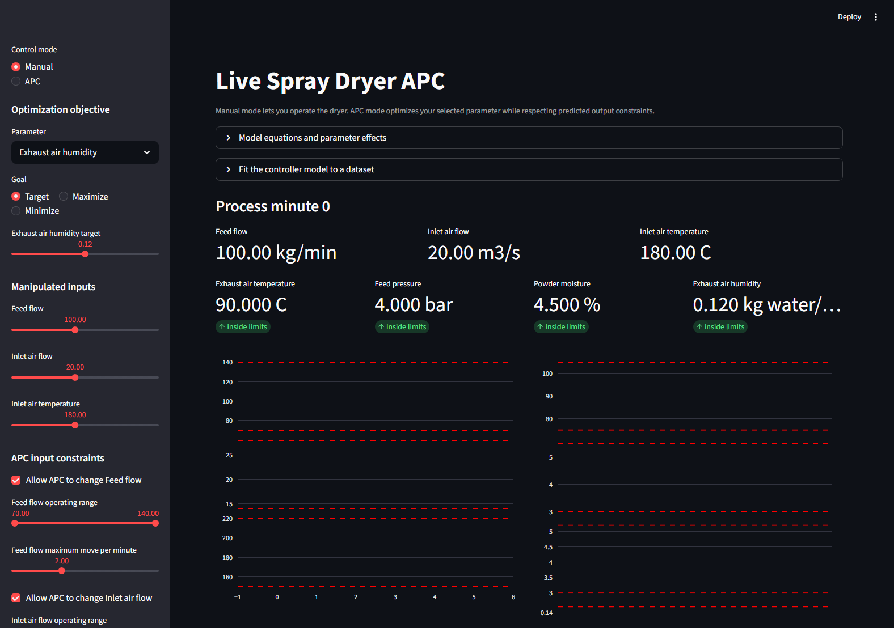

# APC Spray Dryer Learning Lab

A transparent Python learning project that progresses from single-input
process-control foundations to a live, constrained multivariable model
predictive control (MPC) simulation.

> [!CAUTION]
> All process values, gains, operating ranges, time constants, disturbances,
> and datasets in this repository are synthetic educational examples. The
> models are not validated for an industrial spray dryer. This software is not
> intended for plant operation, process safety, production decisions, or
> connection to real equipment.



## Who This Is For

The project is aimed at process and control engineers learning Python, plus
technical reviewers interested in an inspectable control-engineering example.
It favors visible equations and small implementations over production-grade
control infrastructure.

## Learning Progression

### 1. SISO Foundations

`run_lab.py` is the introductory track. It uses powder moisture as the
controlled variable, inlet-air temperature as the manipulated variable, and
inlet humidity as a disturbance. It demonstrates:

1. a first-order process simulation with noise and dead time;
2. a hand-written PID with anti-windup and actuator limits;
3. first-order-plus-dead-time (FOPDT) fitting from a step test;
4. a small SISO MPC and a PID-versus-MPC comparison.

Running this script writes reproducible plots to the ignored `artifacts/`
directory.

### 2. Live Multivariable MPC

`live_app.py` is the capstone track. Its Streamlit dashboard simulates three
manipulated variables:

- feed flow;
- inlet-air flow;
- inlet-air temperature.

The model predicts four constrained outputs:

- exhaust-air temperature;
- feed pressure;
- powder moisture;
- exhaust-air humidity.

In Manual mode, the input sliders operate the synthetic dryer. In APC mode,
the controller repeatedly predicts future behavior, optimizes one selected
target/maximize/minimize objective, applies the first move, and solves again.
Each input has an operating range, move limit, and enable/freeze switch.

The dashboard also exposes the gain-and-lag equations, parameter effects,
predicted trajectories, active constraints, and a CSV workflow for fitting the
controller model to synthetic or user-supplied data.

## Architecture

| Path | Purpose |
| --- | --- |
| `live_app.py` | Streamlit UI and live simulation orchestration. |
| `run_lab.py` | Runnable SISO learning sequence and static figures. |
| `apc_lab/live_dryer.py` | Synthetic multivariable process and constrained MPC. |
| `apc_lab/model_fitting.py` | Multivariable gain, time-constant, and delay fitting. |
| `apc_lab/spray_dryer.py` | Introductory SISO process simulation. |
| `apc_lab/pid.py` | PID implementation with anti-windup and limits. |
| `apc_lab/identification.py` | SISO FOPDT model and step-response fitting. |
| `apc_lab/mpc.py` | Introductory SISO MPC. |
| `tests/` | Deterministic process, controller, constraint, and fitting tests. |

The live steady-state model has the form:

```text
y_ss = y_nominal + K @ (u_delayed - u_nominal)
y[k+1] = y[k] + (y_ss[k] - y[k]) / tau + measurement_noise
```

The dashboard displays the complete synthetic gain matrix and explains the
direction and speed of each input/output effect.

## Installation

Python 3.10 or newer is required.

```powershell
python -m venv .venv
.\.venv\Scripts\Activate.ps1
python -m pip install --upgrade pip
python -m pip install -e ".[dev]"
```

On macOS or Linux, activate the environment with
`source .venv/bin/activate`.

## Run

Start the live dashboard:

```powershell
streamlit run live_app.py
```

Run the SISO learning sequence:

```powershell
python run_lab.py
```

## Test

```powershell
python -m pytest -q
python -c "from streamlit.testing.v1 import AppTest; app=AppTest.from_file('live_app.py'); app.run(timeout=30); assert not app.exception"
python -m pip check
```

The tests use fixed seeds and synthetic data so results remain reproducible.

## Model Fitting Data

The dashboard accepts evenly sampled, time-ordered CSV data with these exact
columns:

```text
Feed flow
Inlet air flow
Inlet air temperature
Exhaust air temperature
Feed pressure
Powder moisture
Exhaust air humidity
```

An example synthetic identification dataset can be downloaded directly from
the app. Uploaded data is processed in the active Streamlit session and is not
written to the repository by the application.

## Limitations

- The process is a linear educational approximation, not a mass-and-energy
  balance or validated equipment model.
- The multivariable model uses one common input delay and first-order dynamics.
- The MPC supports one primary objective at a time.
- Constraints and solver fallback behavior are suitable for demonstration, not
  safety-critical control.
- Dataset fitting assumes clean, numeric, evenly sampled data and does not
  provide statistical confidence or plant-model validation.
- Streamlit rerenders the live panel periodically, so minor chart redraw is
  expected.

## License

Released under the [MIT License](LICENSE).
